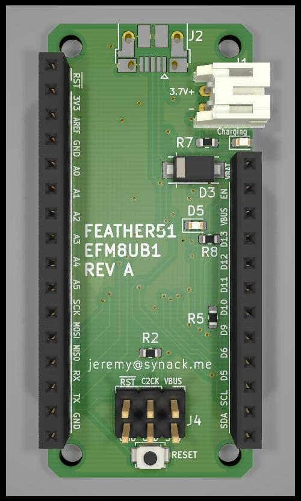
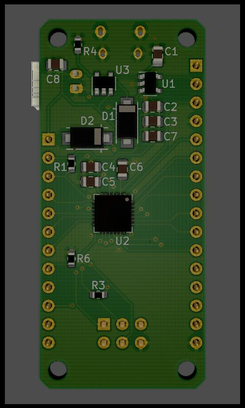

# FEATHER51

**This project is a work in progress**

FEATHER51 is an [Adafruit Feather](https://learn.adafruit.com/adafruit-feather/feather-specification) compatible main-board using the Silicon Labs EFM8UB1 microcontroller. It is designed to be an easy entry point for learning assembly language on real hardware using an open source toolchain. This project is Open Source Hardware! See [LICENSE](LICENSE) for details.

# Project status

Ten revision A boards have been manufactured and are currently undergoing testing/development. The efm8flash utility is being developed as a portable open source flash programming tool for the factory USB bootloader. It has bugs.

[Schematic](feather51/feather51.pdf)

